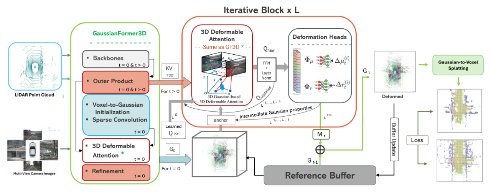

# Occ4DGS: Feed-Forward Online Dynamic 3D Gaussian Splatting for Occupancy Prediction

**A feedforward, online alternative to per-frame Gaussian reconstruction for 3D semantic occupancy prediction in autonomous driving.**

> La Min Maung, advised by Prof. Jui-Chiu (Rachael) Chiang
> CCU Autonomous Driving Perception Lab, National Chung Cheng University

---



## News
- **[2026/09/20]** Internship concludes.
- **[2026/09/13]** Final report submitted.
- **[2026/04/20]** Internship begins.

## Overview

Dense 3D semantic occupancy prediction is important for safe autonomous driving. Recent methods represent a scene as a sparse, object-centric set of 3D Gaussians rather than a dense voxel grid — but reconstruct this representation entirely from scratch on every frame, treating each frame as an independent, static scene.

**Occ4DGS** instead proposes a feedforward, online dynamic Gaussian representation: a **Static Gaussian Generation** module reconstructs a scene once, from its first frame, reusing [GaussianFormer3D](https://github.com/LaMinMaung193/GaussianFormer3D)'s own real reconstruction pipeline unchanged. A lightweight **Dynamic Deformation** module then propagates this representation forward in time, updating it for every subsequent frame as it arrives by predicting the scene's own residual motion — without re-running full reconstruction or requiring future frames.

See [`docs/ARCHITECTURE.md`](docs/ARCHITECTURE.md) for the complete architecture, module-by-module flow, and formal math.

## Key Results

All results evaluated on the same 140 held-out validation scenes from the official nuScenes train/val split.

| Method | mIoU ↑ | Params | Latency (ms) ↓ |
|---|---|---|---|
| Static 3DGS (fresh, per-frame reconstruction) | **25.13** | 57.61M | 548.2 |
| Do-nothing baseline (no deformation) | 16.75 | — | — |
| **Occ4DGS, Dynamic Deformation (L=2, ours)** | **18.44** | **4.43M** | **359.5** |

The Dynamic Deformation module improves meaningfully over the do-nothing baseline while requiring only a single lightweight feedforward pass per frame, using roughly **13× fewer parameters** than the full reconstruction pipeline it replaces.

See [`docs/RESULTS.md`](docs/RESULTS.md) for full per-class breakdowns, the complete efficiency benchmark, the ablation study, and qualitative comparisons across four representative scenes.

## Getting Started

This project involves two repositories: this one (Occ4DGS, the primary project) and a modified fork of [GaussianFormer3D](https://github.com/LaMinMaung193/GaussianFormer3D), which provides Stage A (Static Gaussian Generation) and holds the real Stage B training/evaluation/benchmarking scripts in its own `occ4dgs_scripts/` directory. Clone both.

### Installation

```bash
conda create -n gf3d python=3.8
conda activate gf3d
pip install -r requirements.txt
```

`GaussianFormer3D` has its own, additional dependencies (mmdet3d, mmcv, spconv, DFA3D) — see its own `README.md`/`docker/` for setup.

### Data Preparation

This project requires the nuScenes dataset, SurroundOcc occupancy annotations, and several derived/cached files (dataset info `.pkl`s, the released Stage A checkpoint, generated depth ground-truth, and the cached `G_0` Gaussian representations). See [`docs/DATA_AND_CHECKPOINTS.md`](docs/DATA_AND_CHECKPOINTS.md) for the complete file list, download links, and expected directory layout.

### Quick Evaluation

Once data is in place, the fastest way to confirm the setup works is reproducing the do-nothing baseline (Table 2), then the Dynamic Deformation module's own result on top of it (Table 3):

```bash
# Do-nothing baseline (Table 2) -- from Occ4DGS
cd Occ4DGS
python scripts/baseline_do_nothing.py
```

Expected result: `mIoU: 16.75`.

```bash
# Occ4DGS (ours), Dynamic Deformation, L=2 (Table 3) -- from GaussianFormer3D
cd ../GaussianFormer3D
python occ4dgs_scripts/eval_stageb_checkpoint.py \
    --checkpoint <path-to-checkpoints_L2/epoch_24.pth> \
    --num_blocks 2 \
    --out /tmp/eval_L2.json
```

Expected result: `mIoU: 18.44` — the deformation module's real improvement over the do-nothing baseline above.

### Training

```bash
cd Occ4DGS
python scripts/train_stageb.py
```

**For the complete, step-by-step guide** — extracting `G_0`, training, evaluating all three configurations, and generating the report's qualitative figures and efficiency benchmark — see [`docs/REPRODUCING_RESULTS.md`](docs/REPRODUCING_RESULTS.md).

## Repository Structure

```
Occ4DGS/
├── docs/
│   ├── ARCHITECTURE.md              # Final architecture, module flow, and math
│   ├── RESULTS.md                   # Full results: tables, ablation, qualitative figures
│   ├── REPRODUCING_RESULTS.md       # Step-by-step reproduction guide
│   ├── DATA_AND_CHECKPOINTS.md      # Data/checkpoint download links and layout
│   ├── IMPLEMENTATION_ROADMAP.md    # Development history (Stage A, phases 0-5B)
│   ├── EXPERIMENT_LOG_TEMPLATE.md   # Template used by EXPERIMENT_LOG.md
│   ├── assets/                      # Architecture diagram, result tables, qualitative figures
│   └── deprecated/                  # Superseded design documents, kept for history
├── src/
│   ├── datasets/                    # Dataset adapters and StageBTrainingDataset
│   ├── models/stage_b_temporal/     # Dynamic Deformation module (buffer, encoder,
│   │                                #   deformation heads, transforms)
│   └── deprecated/                  # Superseded/unfinished code (losses, eval,
│                                     #   training stubs, mini-dataset-era modules)
├── scripts/
│   ├── baseline_do_nothing.py       # Do-nothing baseline evaluation
│   ├── train_stageb.py              # Dynamic Deformation training loop
│   ├── plot_qualitative.py          # Qualitative BEV comparison figures
│   ├── plot_gaussians.py            # Raw Gaussian primitive visualization
│   └── deprecated/                  # Earlier phases and abandoned exploration
├── configs/
├── experiments/
├── tests/
├── EXPERIMENT_LOG.md                # Full, run-by-run development history
├── GIT_WORKFLOW.md
└── requirements.txt
```

## Related Projects

This project builds directly upon [GaussianFormer3D](https://github.com/NVlabs/GaussianFormer3D) (Zhao et al., ICRA 2026), reusing its reconstruction pipeline and 3D deformable attention mechanism unchanged for the Static Gaussian Generation stage. GaussianFormer3D itself builds upon [GaussianFormer](https://github.com/huang-yh/GaussianFormer), [BEVFormer](https://github.com/fundamentalvision/bevformer), [BEVDepth](https://github.com/megvii-basedetection/bevdepth), and [DFA3D](https://github.com/IDEA-Research/3D-deformable-attention). We sincerely thank the authors of all these works for their contributions to the community.

## Citation

If you find this work useful, please consider citing:

```bibtex
@techreport{maung2026occ4dgs,
  title  = {Occ4DGS: Feedforward Online Dynamic 3D Gaussian Splatting for
            Occupancy Prediction in Autonomous Driving},
  author = {Maung, La Min},
  institution = {National Chung Cheng University},
  year   = {2026}
}
```

## Acknowledgements

This work was supported by the College of Engineering, National Chung Cheng University, Taiwan, Republic of China.