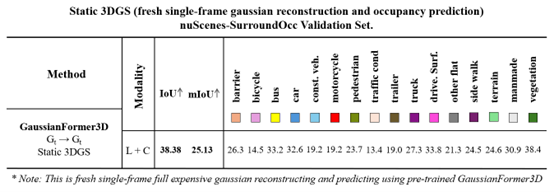
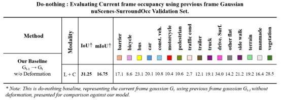
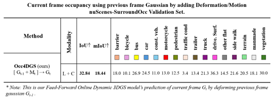
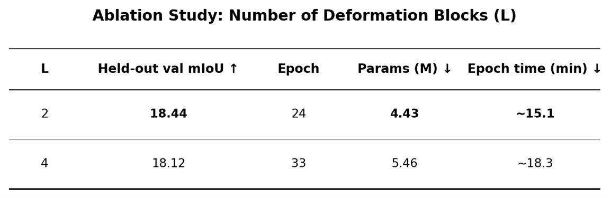
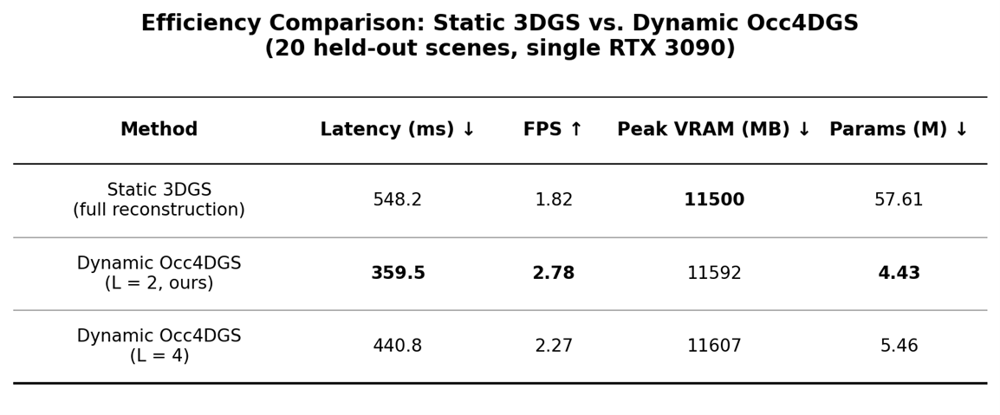
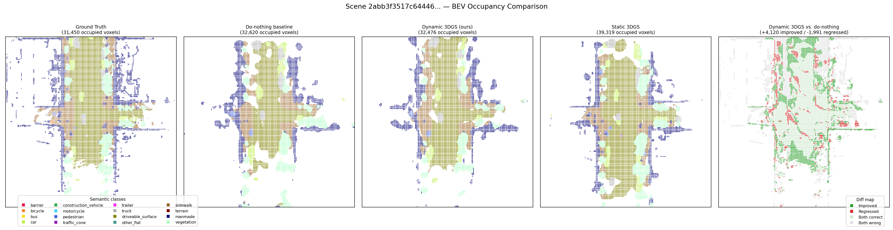
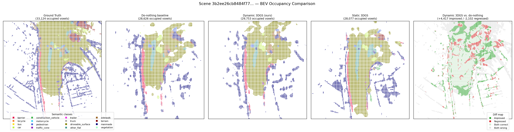
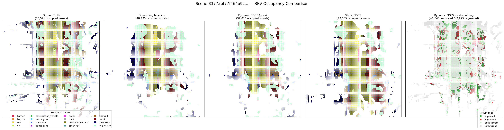
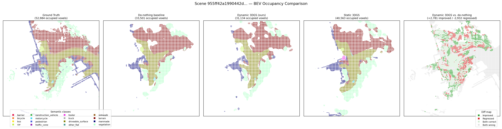

# Results

Full quantitative and qualitative results for Occ4DGS. All evaluations use the same 140 held-out validation scenes from the official nuScenes train/val split. See [`ARCHITECTURE.md`](ARCHITECTURE.md) for the method and [`REPRODUCING_RESULTS.md`](REPRODUCING_RESULTS.md) for exact commands to reproduce every number below.

## 1. Static 3DGS (fresh, per-frame reconstruction)

A genuine upper-bound reference: the Static Generation module is run fresh and independently on each evaluated frame (no temporal reuse at all), giving the best-case reconstruction quality at the full computational cost of Stage A's own reconstruction pipeline, every frame.

## 2. Do-Nothing Baseline

The previous frame's Gaussian set $G_{t-1}$, transformed into the current frame's ego-centric coordinate frame, is used directly as the prediction — with no deformation applied. This isolates how much of next-frame occupancy is already explained by static scene structure and ego-motion compensation alone.

## 3. Dynamic Deformation (Occ4DGS, ours)

The full feedforward model: $G_{t-1}$ is deformed by the trained Dynamic Deformation module before splatting.

**Summary across all three configurations:**

| Method | mIoU ↑ | iou2 ↑ |
|---|---|---|
| Static 3DGS | 25.13 | 38.38 |
| Do-nothing baseline | 16.75 | 31.25 |
| **Dynamic Occ4DGS (L=2, ours)** | **18.44** | **32.84** |

## 4. Ablation Study: Number of Deformation Blocks (L)

$L \in \{2, 4\}$, with every other setting (data split, optimizer, learning-rate schedule, training length) held identical.

$L=2$ achieves the best held-out mIoU while using fewer parameters and training faster per epoch — no accuracy/efficiency trade-off needs to be weighed, since $L=2$ wins on both grounds.

## 5. Efficiency Comparison

Real, measured inference latency, peak VRAM, and parameter count, averaged over 20 held-out scenes on a single RTX 3090.

Dynamic Occ4DGS (L=2) uses roughly 13× fewer parameters than the full Static pipeline and runs faster overall, though the latency gain is more moderate than the parameter count alone suggests — a shared backbone feature-extraction cost dominates both pipelines almost equally, with the deformation step itself being genuinely lightweight on top of it. Peak VRAM is essentially unchanged across all three configurations, since that same shared backbone dominates memory too.

## Qualitative Results

For four representative held-out validation scenes, each figure shows a five-panel bird's-eye-view comparison: **Ground Truth** (the real annotated occupancy for that frame), **Do-nothing baseline** (the previous frame's Gaussians reused unchanged), **Dynamic 3DGS (ours)**, **Static 3DGS** (the fresh, independently-reconstructed reference), and a **difference map** contrasting the Dynamic 3DGS prediction directly against the do-nothing baseline — colored by whether the deformation module improved the prediction relative to ground truth (green), regressed it (red), or left it unchanged (muted gray/beige).

